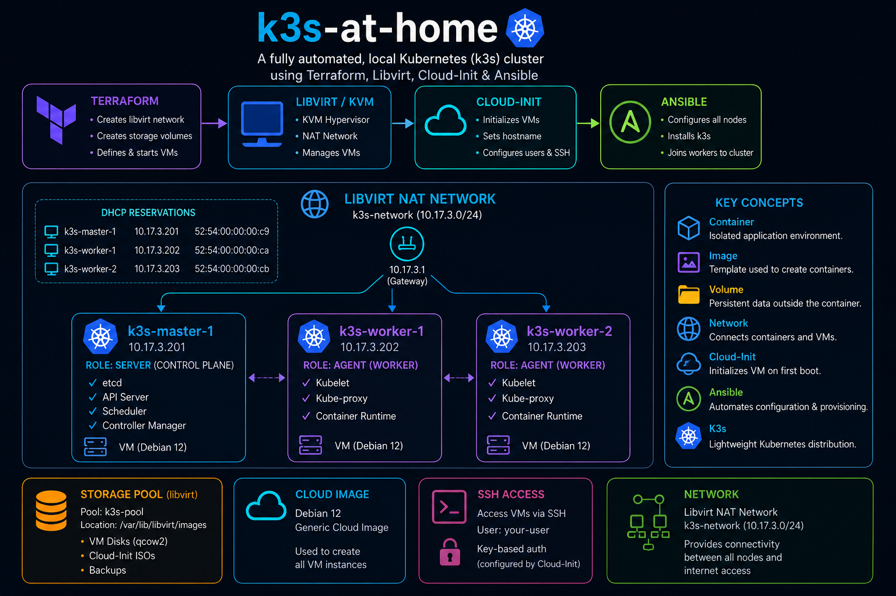

# K3s at Home

A lightweight Kubernetes homelab built with **Terraform**, **Libvirt (KVM/QEMU)**, **Cloud-Init**, **Ansible**, and **K3s**.

This project automates the deployment of a three-node Kubernetes cluster on a local Linux host using infrastructure-as-code principles. Virtual machines are provisioned through Libvirt, configured with Cloud-Init, and prepared for Kubernetes installation using Ansible.

---

## Architecture

<p align="center">
  
</p>

### Cluster Layout

| Node | Role | IP Address | vCPU | RAM |
|--------|--------|------------|------|------|
| k3s-master-1 | Control Plane | 10.17.3.201 | 2 | 2 GB |
| k3s-worker-1 | Worker | 10.17.3.202 | 1 | 1.5 GB |
| k3s-worker-2 | Worker | 10.17.3.203 | 1 | 1.5 GB |

### Networking

| Setting | Value |
|----------|--------|
| Network Name | k3s-network |
| Network Type | NAT |
| Subnet | 10.17.3.0/24 |
| Gateway | 10.17.3.1 |
| DHCP | Static Reservations |
| DNS Domain | k3s.local |

### Operating System

- Debian 12 (Bookworm) Generic Cloud Image
- Cloud-Init configured
- QEMU Guest Agent installed
- SSH key authentication enabled

---

## Tech Stack

### Infrastructure

- Terraform
- Libvirt
- KVM/QEMU
- Cloud-Init

### Configuration Management

- Ansible

### Kubernetes

- K3s

### Operating System

- Debian 12 (Bookworm)

---

## Features

- Automated VM provisioning with Terraform
- Dedicated Libvirt NAT network
- Static DHCP reservations
- Cloud-Init based provisioning
- SSH key deployment
- Serial console support for headless management
- QEMU Guest Agent integration
- Infrastructure defined entirely as code
- Repeatable and reproducible environment

---

## Prerequisites

Install the following on your Linux host:

### Ubuntu

```bash
sudo apt update

sudo apt install -y \
  qemu-kvm \
  libvirt-daemon-system \
  libvirt-clients \
  virtinst \
  bridge-utils \
  terraform
```

Add your user to the libvirt group:

```bash
sudo usermod -aG libvirt $USER
newgrp libvirt
```

Verify Libvirt is running:

```bash
sudo systemctl status libvirtd
```

---

## Project Structure

```text
k3s-at-home/
├── terraform/
│   ├── main.tf
│   ├── variables.tf
│   ├── outputs.tf
│   ├── network.tf
│   ├── compute.tf
│   ├── storage.tf
│   └── cloud-init/
│
├── ansible/
│   ├── inventory.ini
│   ├── playbooks/
│   ├── roles/
│   └── group_vars/
│
├── images/
│   └── diagram.png
│
└── README.md
```

---

## Cloud-Init Configuration

Cloud-Init is responsible for:

- Hostname configuration
- User creation
- SSH key deployment
- Password configuration
- Package installation
- QEMU Guest Agent setup
- Serial console configuration

Installed packages include:

```text
qemu-guest-agent
open-iscsi
nfs-common
```

---

## Deployment

Initialize Terraform:

```bash
terraform init
```

Review the execution plan:

```bash
terraform plan
```

Deploy the infrastructure:

```bash
terraform apply
```

Or:

```bash
terraform apply -auto-approve
```

---

## Verifying Deployment

List running virtual machines:

```bash
virsh list
```

Check DHCP leases:

```bash
sudo virsh net-dhcp-leases k3s-network
```

Expected output:

```text
10.17.3.201  k3s-master-1
10.17.3.202  k3s-worker-1
10.17.3.203  k3s-worker-2
```

Connect to a VM:

```bash
ssh mike@10.17.3.201
```

Access the serial console:

```bash
virsh console k3s-master-1
```

Exit the console:

```text
Ctrl + ]
```

---

## Destroying the Environment

Remove all resources:

```bash
terraform destroy
```

Or:

```bash
terraform destroy -auto-approve
```

---

## Troubleshooting

### No DHCP Lease Assigned

Check the network:

```bash
sudo virsh net-list --all
```

Inspect DHCP leases:

```bash
sudo virsh net-dhcp-leases k3s-network
```

Inspect network configuration:

```bash
sudo virsh net-dumpxml k3s-network
```

---

### Cannot Access Console

Ensure Cloud-Init has configured serial console support:

```bash
virsh console k3s-master-1
```

---

### Guest Agent Not Detected

Verify inside the VM:

```bash
systemctl status qemu-guest-agent
```

---

## Future Improvements

- Automated K3s installation with Ansible
- Multi-master HA cluster
- MetalLB integration
- Longhorn storage
- ArgoCD deployment
- Monitoring stack (Prometheus + Grafana)
- GitOps workflows
- Automated certificate management
- Backup and restore automation

---

## License

MIT License